# Bee Epic 8: Navigation Redesign & PARA Folder System - UI/UX Specification

## Introduction

This document defines the user experience goals, information architecture, user flows, and visual design specifications for **Bee's Epic 8 - Navigation Redesign & PARA Folder System**. It serves as the foundation for visual design and frontend development, ensuring a cohesive and user-centered experience.

### Change Log

| Date       | Version | Description                                      | Author       |
| ---------- | ------- | ------------------------------------------------ | ------------ |
| 2026-01-12 | 1.0     | Initial front-end spec for Epic 8 navigation UX | Sally (UX)   |

---

## 1. Problem Statement

### Current State Issues

The current Bee navigation has critical UX problems that prevent users from effectively using the PARA organizational system:

| Issue | Current State | Impact |
|-------|---------------|--------|
| **PARA invisible in sidebar** | Sidebar shows only: Home, Inbox, Review, Search, Calendar, Settings | Users cannot access Projects, Areas, Resources, or Archive from main navigation |
| **PARANav component unused** | A full PARA navigation component exists (`para-nav.tsx`) but is not integrated into the main layout | Wasted development effort; users miss the feature |
| **Objectives hidden** | `/objectives` page exists but has no navigation link | Users cannot discover or access their goals |
| **No folder hierarchy** | Database lacks folder/subfolder structure | Users cannot organize items within Projects/Areas/Resources |
| **Flat navigation** | All nav items at same visual level | No information hierarchy communicated |

### Evidence

**Current Sidebar** ([sidebar.tsx](apps/web/src/components/navigation/sidebar.tsx)):
```
Home → Inbox → Review → Search → Calendar → Settings
```

**What Should Exist** (based on PRD FR24):
```
Quick Access → PARA (Projects/Areas/Resources/Archive) → Settings
```

---

## 2. UX Goals & Principles

### Target User Personas

**Primary User: Productivity Enthusiast**
- Uses GTD or PARA methodology for personal organization
- Manages multiple projects across different life areas (Work, Home, Health)
- Captures thoughts quickly and processes them later
- Needs hierarchy to stay organized as their system grows
- Primary device: Mobile for capture, Desktop for organization

**Secondary User: Goal-Oriented Planner**
- Sets objectives at yearly/monthly/weekly timeframes
- Links actions to larger goals
- Values seeing progress and maintaining momentum
- Needs visibility into how daily work connects to objectives

### Usability Goals

| Goal | Success Metric |
|------|----------------|
| **Navigational clarity** | Users can reach any Project, Area, or Resource within 2 clicks from anywhere |
| **Hierarchy visibility** | Users can see the PARA organizational structure at a glance in the sidebar |
| **Action-first efficiency** | Daily workflows (Inbox, Today, Review) remain the fastest paths (top of sidebar) |
| **Cross-device consistency** | Same navigation model on mobile drawer and desktop sidebar |
| **Discoverability** | New users find Objectives and PARA sections without documentation |

### Design Principles

1. **Action-first, PARA-second** - Quick Access section always visible at top; PARA is the organizational backbone below
2. **Progressive disclosure** - Collapse/expand sections to manage complexity; show depth on demand
3. **Spatial consistency** - Items stay in predictable locations across sessions; user muscle memory is preserved
4. **Visual hierarchy** - Use indentation, icons, colors, and badges to communicate structure
5. **Mobile-native** - Design for touch first, enhance for desktop pointer interactions

---

## 3. Information Architecture

### 3.1 Site Map

```mermaid
graph TD
    ROOT[🐝 Bee App] --> QA[Quick Access]
    ROOT --> PARA[PARA System]
    ROOT --> SETTINGS[Settings]

    QA --> INBOX[📥 Inbox]
    QA --> TODAY[📅 Today]
    QA --> OBJ[🎯 Objectives]
    QA --> REVIEW[▶️ Review]
    QA --> SEARCH[🔍 Search]
    QA --> CAL[📆 Calendar]

    PARA --> PROJECTS[📁 Projects]
    PARA --> AREAS[📁 Areas]
    PARA --> RESOURCES[📁 Resources]
    PARA --> ARCHIVE[📁 Archive]

    PROJECTS --> P1[Project 1]
    PROJECTS --> P2[Project 2]
    P1 --> P1F1[Folder 1.1]
    P1 --> P1F2[Folder 1.2]
    P1F1 --> P1F1S1[Subfolder 1.1.1]

    AREAS --> A1[Area 1]
    AREAS --> A2[Area 2]
    A1 --> A1F1[Folder in Area]

    RESOURCES --> R1[Resource 1]
    ARCHIVE --> ARC1[Archived Project]
```



### 3.2 Navigation Structure

#### Desktop Sidebar (264px width)

```
┌─────────────────────────────────────┐
│ 🐝 Bee                              │  ← Logo/Home link
├─────────────────────────────────────┤
│ ┌─────────────────────────────────┐ │
│ │  + Quick Capture                │ │  ← Primary action button
│ └─────────────────────────────────┘ │
├─────────────────────────────────────┤
│ QUICK ACCESS                        │  ← Section header (uppercase, gray)
│   📥 Inbox                    (12)  │  ← Badge shows unprocessed count
│   📅 Today                     (5)  │  ← Badge shows today's actions
│   🎯 Objectives                     │  ← Link to /objectives
│   ▶️  Review                        │  ← Link to /review (daily swipe)
│   🔍 Search                         │  ← Link to /search
│   📆 Calendar                       │  ← Link to /calendar
├─────────────────────────────────────┤
│ PARA                                │  ← Section header
│ ▼ Projects                     [+]  │  ← Collapsible, + creates new
│   ├─ 🔵 Website Redesign      (3)  │  ← Color dot, action count badge
│   │  ├─ 📁 Research                │  ← Folder (Phase 2)
│   │  └─ 📁 Design                  │  ← Folder (Phase 2)
│   └─ 🟢 Mobile App            (1)  │
│ ▼ Areas                        [+]  │  ← Collapsible, + creates new
│   ├─ 💼 Work                  (5)  │  ← Emoji icon, action count
│   │  └─ 📁 Meetings                │  ← Folder (Phase 2)
│   └─ 🏠 Home                  (2)  │
│ ▶ Resources                         │  ← Collapsed by default
│ ▶ Archive                           │  ← Collapsed by default
├─────────────────────────────────────┤
│ ⚙️ Settings                         │
├─────────────────────────────────────┤
│ ┌──────┐                            │
│ │ 👤   │ Hugo Bordg                 │  ← User avatar + name
│ └──────┘ hugo@example.com           │  ← User email
│ [Sign Out]                          │
└─────────────────────────────────────┘
```

#### Mobile Navigation

**Bottom Navigation Bar** (fixed, 56px height):
```
┌─────────────────────────────────────────────────────┐
│  🏠 Home  │  📥 Inbox  │  ▶️ Review  │  🔍 Search  │  ☰ Menu  │
└─────────────────────────────────────────────────────┘
```

**Menu (☰) opens Slide-out Drawer** (full sidebar content):
- Same structure as desktop sidebar
- Slides in from left
- Overlay backdrop closes drawer
- Touch-friendly: 44px minimum tap targets

---

## 4. Detailed Component Specifications

### 4.1 Unified Sidebar Component

**File:** `apps/web/src/components/navigation/unified-sidebar.tsx`

**Replace:** Current `sidebar.tsx` which lacks PARA sections

**Props Interface:**
```typescript
interface UnifiedSidebarProps {
  user: {
    name?: string | null;
    email?: string | null;
    image?: string | null;
  };
  className?: string;
}
```

**Data Requirements:**
| Data | Source | tRPC Query |
|------|--------|------------|
| Inbox count | `inboxItem` table | `trpc.inbox.getUnprocessedCount` |
| Today's actions | `action` table | `trpc.actions.getTodayCount` |
| Projects list | `project` table | `trpc.para.listProjects({ status: "active" })` |
| Areas list | `area` table | `trpc.para.listAreas()` |
| Action counts per project | `action` table | Included in `listProjects` via `_count` |
| Action counts per area | `action` table | Included in `listAreas` via `_count` |

**Behavior:**

| Interaction | Behavior |
|-------------|----------|
| Click logo | Navigate to `/dashboard` |
| Click Quick Capture | Open capture modal |
| Click nav item | Navigate to route, highlight active state |
| Click section chevron (▼/▶) | Toggle section expand/collapse |
| Click [+] button | Open create modal (Project or Area) |
| Hover nav item | Show hover background color |
| Active route | Show primary color background, bold text |

**State Management:**
```typescript
const [expandedSections, setExpandedSections] = useState({
  projects: true,   // Default expanded
  areas: true,      // Default expanded
  resources: false, // Default collapsed
  archive: false,   // Default collapsed
});
```

**Persistence:** Store `expandedSections` in `localStorage` key `bee-sidebar-state`

### 4.2 Quick Access Section

**Items (in order):**

| # | Label | Icon | Route | Badge | Description |
|---|-------|------|-------|-------|-------------|
| 1 | Inbox | `Inbox` (lucide) | `/inbox` | Unprocessed count | All captured items awaiting processing |
| 2 | Today | `Calendar` (lucide) | `/today` | Today's action count | Actions due or scheduled for today |
| 3 | Objectives | `Target` (lucide) | `/objectives` | None | Yearly/Monthly/Weekly goals |
| 4 | Review | `PlayCircle` (lucide) | `/review` | None | Daily swipe review (fullscreen) |
| 5 | Search | `Search` (lucide) | `/search` | None | Semantic search |
| 6 | Calendar | `CalendarDays` (lucide) | `/calendar` | None | Outlook calendar view |

**Note:** `/today` route does not currently exist - needs to be created as part of this epic or routed to dashboard with today filter.

### 4.3 PARA Sections

#### Projects Section

**Header Row:**
- Label: "Projects" (uppercase)
- Chevron: `ChevronDown` when expanded, `ChevronRight` when collapsed
- Add button: `Plus` icon, opens `CreateProjectModal`

**Project Items:**
- Icon: `FolderKanban` (lucide) with `color` from project record
- Label: Project name (truncate at 20 chars with ellipsis)
- Badge: Action count (`project._count.actions`)
- Route: `/projects/{project.id}`

**Empty State:** "No active projects" (muted text)

#### Areas Section

**Header Row:**
- Label: "Areas" (uppercase)
- Chevron: Expand/collapse toggle
- Add button: Opens `CreateAreaModal`

**Area Items:**
- Icon: Area's `icon` field (emoji) OR `CircleDot` (lucide) with `color`
- Label: Area name (truncate at 20 chars)
- Badge: Action count (`area._count.actions`)
- Route: `/areas/{area.id}`

**Empty State:** "No areas yet" (muted text)

#### Resources Section

**Header Row:**
- Label: "Resources" (uppercase)
- Chevron: Expand/collapse toggle
- No add button (resources created via different flow)

**When Expanded:**
- Single link: "View all" → `/resources`

#### Archive Section

**Header Row:**
- Label: "Archive" (uppercase)
- Chevron: Expand/collapse toggle

**When Expanded:**
- Single link: "Browse archive" → `/archive`

### 4.4 Mobile Bottom Navigation

**File:** `apps/web/src/components/navigation/bottom-nav.tsx`

**Modification Required:** Add 5th item "Menu" to open sidebar drawer

**Items:**

| # | Label | Icon | Action |
|---|-------|------|--------|
| 1 | Home | `Home` | Navigate to `/dashboard` |
| 2 | Inbox | `Inbox` | Navigate to `/inbox` (with badge) |
| 3 | Review | `PlayCircle` | Navigate to `/review` |
| 4 | Search | `Search` | Navigate to `/search` |
| 5 | Menu | `Menu` | Open sidebar drawer |

### 4.5 Mobile Sidebar Drawer

**File:** `apps/web/src/components/navigation/mobile-drawer.tsx` (new)

**Behavior:**
- Triggered by: Menu button in bottom nav
- Animation: Slide in from left (300ms ease-out)
- Width: 85% of screen width, max 320px
- Backdrop: Semi-transparent black, tap to close
- Close button: X in top right of drawer
- Content: Same as desktop sidebar

---

## 5. User Flows

### 5.1 Navigate to Project

**User Goal:** Access a specific project to view its actions and notes

**Entry Points:**
- Sidebar (desktop)
- Drawer menu (mobile)

**Flow:**


**Success Criteria:** User reaches project detail in ≤2 clicks from any page

### 5.2 Create New Project from Sidebar

**User Goal:** Quickly create a new project without leaving current context

**Flow:**


**Edge Cases:**
- Duplicate name: Show validation error "A project with this name already exists"
- Empty name: Disable Create button until name entered
- API error: Show error toast, keep modal open

### 5.3 Access Objectives

**User Goal:** View and manage yearly/monthly/weekly objectives

**Current Problem:** No navigation link to `/objectives`

**New Flow:**


---

## 6. Visual Design Specifications

### 6.1 Sidebar Dimensions

| Element | Value |
|---------|-------|
| Sidebar width | 264px (desktop) |
| Sidebar width mobile drawer | 85vw, max 320px |
| Logo section height | 64px |
| Capture button section padding | 16px horizontal, 16px top |
| Section header padding | 12px horizontal, 8px vertical |
| Nav item height | 40px |
| Nav item padding | 12px horizontal |
| Nav item icon size | 20px |
| Nav item gap (icon to text) | 12px |
| Nested item indent | 24px per level |
| Badge padding | 4px 8px |
| User section height | 80px |

### 6.2 Colors

| Element | Light Mode | Dark Mode (if applicable) |
|---------|------------|---------------------------|
| Sidebar background | `#FFFFFF` | `#1F2937` |
| Section header text | `#6B7280` (gray-500) | `#9CA3AF` |
| Nav item text (default) | `#374151` (gray-700) | `#E5E7EB` |
| Nav item text (hover) | `#111827` (gray-900) | `#FFFFFF` |
| Nav item background (hover) | `#F3F4F6` (gray-100) | `#374151` |
| Nav item text (active) | `#2563EB` (blue-600) | `#60A5FA` |
| Nav item background (active) | `#EFF6FF` (blue-50) | `#1E3A5F` |
| Badge background | `#E5E7EB` (gray-200) | `#374151` |
| Badge text | `#374151` (gray-700) | `#E5E7EB` |
| Divider | `#E5E7EB` (gray-200) | `#374151` |
| Add button | `#6B7280` (gray-500) | `#9CA3AF` |
| Add button hover | `#374151` (gray-700) | `#E5E7EB` |

### 6.3 Typography

| Element | Font | Size | Weight | Line Height |
|---------|------|------|--------|-------------|
| Logo text | System | 20px | 700 (bold) | 28px |
| Section header | System | 11px | 600 (semibold) | 16px |
| Nav item | System | 14px | 500 (medium) | 20px |
| Nav item (active) | System | 14px | 600 (semibold) | 20px |
| Badge | System | 12px | 500 | 16px |
| User name | System | 14px | 500 | 20px |
| User email | System | 12px | 400 | 16px |

### 6.4 Icons

**Icon Library:** Lucide React (already in use)

| Context | Icon Name | Size |
|---------|-----------|------|
| Quick Access - Inbox | `Inbox` | 20px |
| Quick Access - Today | `Calendar` | 20px |
| Quick Access - Objectives | `Target` | 20px |
| Quick Access - Review | `PlayCircle` | 20px |
| Quick Access - Search | `Search` | 20px |
| Quick Access - Calendar | `CalendarDays` | 20px |
| PARA - Projects | `FolderKanban` | 16px |
| PARA - Areas | `CircleDot` or emoji | 16px |
| PARA - Resources | `Library` | 16px |
| PARA - Archive | `Archive` | 16px |
| Section expand | `ChevronDown` | 12px |
| Section collapse | `ChevronRight` | 12px |
| Add button | `Plus` | 12px |
| Settings | `Settings` | 20px |
| Mobile menu | `Menu` | 24px |
| Drawer close | `X` | 24px |

---

## 7. Component Library Updates

### 7.1 New Components Required

| Component | File Path | Purpose |
|-----------|-----------|---------|
| `UnifiedSidebar` | `components/navigation/unified-sidebar.tsx` | Replace current sidebar with PARA-aware version |
| `MobileDrawer` | `components/navigation/mobile-drawer.tsx` | Slide-out menu for mobile |
| `NavSection` | `components/navigation/nav-section.tsx` | Collapsible section with header |
| `NavItem` | `components/navigation/nav-item.tsx` | Individual navigation link |
| `FolderTree` | `components/para/folder-tree.tsx` | Recursive folder display (Phase 2) |

### 7.2 Components to Modify

| Component | Modification |
|-----------|--------------|
| `BottomNav` | Add 5th "Menu" item |
| `AuthLayout` | Use `UnifiedSidebar` instead of current `Sidebar` |
| `InboxBadge` | Reuse in unified sidebar |

### 7.3 Components to Deprecate

| Component | Reason |
|-----------|--------|
| `Sidebar` (current) | Replaced by `UnifiedSidebar` |
| `PARANav` | Functionality merged into `UnifiedSidebar` |

---

## 8. Accessibility Requirements

### 8.1 Compliance Target

**Standard:** WCAG 2.1 AA

### 8.2 Key Requirements

**Visual:**
- Color contrast: Minimum 4.5:1 for normal text, 3:1 for large text
- Focus indicators: Visible focus ring (2px blue outline) on all interactive elements
- Text sizing: Supports browser zoom up to 200%

**Interaction:**
- Keyboard navigation: All sidebar items reachable via Tab key
- Arrow keys: Navigate within sections when focused
- Enter/Space: Activate links and buttons
- Escape: Close mobile drawer

**Screen Reader:**
- Sidebar landmark: `<aside aria-label="Main navigation">`
- Section headers: `role="heading" aria-level="2"`
- Expandable sections: `aria-expanded="true/false"`
- Current page: `aria-current="page"` on active nav item
- Badges: `aria-label="12 unprocessed items"` (not just visual number)

**Touch:**
- Minimum tap target: 44x44px
- Adequate spacing between targets: 8px minimum

---

## 9. Responsiveness Strategy

### 9.1 Breakpoints

| Breakpoint | Min Width | Max Width | Behavior |
|------------|-----------|-----------|----------|
| Mobile | 0px | 767px | Bottom nav + drawer, no visible sidebar |
| Tablet | 768px | 1023px | Collapsible sidebar (can toggle), bottom nav hidden |
| Desktop | 1024px | - | Fixed sidebar always visible, no bottom nav |

### 9.2 Adaptation Patterns

**Layout Changes:**
- Mobile: Content full-width, sidebar hidden, bottom nav visible
- Tablet: Content with optional sidebar, sidebar toggle button in header
- Desktop: Content with 264px left margin for fixed sidebar

**Navigation Changes:**
- Mobile: 5-item bottom nav with Menu button for full navigation
- Tablet: Top header with hamburger menu, sidebar slides over content
- Desktop: Fixed sidebar always visible

---

## 10. Animation & Micro-interactions

### 10.1 Motion Principles

- **Purposeful:** Animations communicate state changes, not decoration
- **Fast:** Keep under 300ms to feel responsive
- **Consistent:** Same easing curves throughout

### 10.2 Key Animations

| Animation | Trigger | Duration | Easing |
|-----------|---------|----------|--------|
| Section expand/collapse | Click chevron | 200ms | ease-out |
| Drawer slide in | Click Menu | 300ms | ease-out |
| Drawer slide out | Click backdrop/X | 200ms | ease-in |
| Nav item hover | Mouse enter | 150ms | ease |
| Badge count change | Data update | 200ms | ease-out |
| Active state transition | Route change | 150ms | ease |

---

## 11. Phase 2: Folder Hierarchy System

### 11.1 Overview

Phase 2 introduces nested folders within Projects, Areas, and Resources. This requires database schema changes and new UI components.

### 11.2 Database Schema Addition

```prisma
model Folder {
  id          String   @id @default(uuid())
  userId      String
  user        User     @relation(fields: [userId], references: [id], onDelete: Cascade)

  // Hierarchy (self-referential)
  parentId    String?
  parent      Folder?  @relation("FolderHierarchy", fields: [parentId], references: [id])
  children    Folder[] @relation("FolderHierarchy")

  // Container reference
  projectId   String?
  project     Project? @relation(fields: [projectId], references: [id])
  areaId      String?
  area        Area?    @relation(fields: [areaId], references: [id])
  resourceId  String?
  resource    Resource? @relation(fields: [resourceId], references: [id])

  name        String
  sortOrder   Int      @default(0)
  createdAt   DateTime @default(now())
  updatedAt   DateTime @updatedAt

  // Items in folder
  actions     Action[]
  notes       Note[]

  @@index([userId])
  @@index([parentId])
  @@index([projectId])
  @@index([areaId])
}
```

### 11.3 Sidebar with Folders

```
▼ Projects                     [+]
  ├─ 🔵 Website Redesign      (3)
  │  ├─ 📁 Research           (1)    ← Folder
  │  │  └─ 📁 Competitors     (0)    ← Subfolder
  │  └─ 📁 Design             (2)    ← Folder
  └─ 🟢 Mobile App            (1)
```

### 11.4 Folder Interactions

| Interaction | Behavior |
|-------------|----------|
| Click folder | Expand/collapse to show subfolders |
| Right-click folder | Context menu: Rename, Delete, Move |
| Drag item to folder | Move item into folder |
| Drag folder | Reorder within parent |
| Click + on project/area | Option to create folder or item |

---

## 12. Implementation Phases

### Phase 1: Navigation Redesign (This Epic)

**Scope:**
1. Create `UnifiedSidebar` component with Quick Access + PARA sections
2. Add Objectives link to Quick Access
3. Update `AuthLayout` to use new sidebar
4. Create `MobileDrawer` component
5. Update `BottomNav` with Menu button
6. Add `/today` route (or redirect to filtered dashboard)
7. Persist sidebar expand/collapse state
8. Deprecate old `Sidebar` and `PARANav` components

**Does NOT Include:**
- Folder hierarchy (Phase 2)
- Drag and drop (Phase 2)
- New database models

### Phase 2: Folder System (Future Epic)

**Scope:**
1. Add `Folder` model to database schema
2. Create folder CRUD operations in PARA service
3. Build `FolderTree` recursive component
4. Enable folder creation from sidebar
5. Implement drag-and-drop for moving items/folders
6. Update item detail pages to show folder breadcrumb

---

## 13. Open Questions for PM

| # | Question | Options | Recommendation |
|---|----------|---------|----------------|
| 1 | Should `/today` be a new page or a filter on dashboard? | New page / Dashboard filter | Dashboard filter (less new code) |
| 2 | Should collapsed sections persist per-device or sync across devices? | localStorage / Database | localStorage (simpler, Phase 1) |
| 3 | Maximum folder nesting depth? | 2 levels / 3 levels / Unlimited | 3 levels (prevents over-organization) |
| 4 | Should Archive show count badge? | Yes / No | No (archive is for hiding, not tracking) |

---

## 14. Success Metrics

| Metric | Current | Target | How to Measure |
|--------|---------|--------|----------------|
| Clicks to reach any Project | 3+ (must type URL) | ≤2 | User testing |
| % users who access Objectives | ~0% (hidden) | >50% | Analytics on `/objectives` visits |
| Time to find PARA structure | N/A (not visible) | <3 seconds | User testing |
| Mobile navigation satisfaction | Unknown | >4/5 rating | User survey |

---

## 15. Appendix: Current vs. Proposed Comparison

### Current Sidebar
```
🐝 Bee
[+ Quick Capture]
─────────────────
Home
Inbox          (12)
Review
Search
Calendar
Settings
─────────────────
👤 User Profile
```

### Proposed Sidebar
```
🐝 Bee
[+ Quick Capture]
─────────────────
QUICK ACCESS
  📥 Inbox           (12)
  📅 Today            (5)
  🎯 Objectives
  ▶️ Review
  🔍 Search
  📆 Calendar
─────────────────
PARA
▼ Projects           [+]
  ├─ 🔵 Website       (3)
  └─ 🟢 Mobile        (1)
▼ Areas              [+]
  ├─ 💼 Work          (5)
  └─ 🏠 Home          (2)
▶ Resources
▶ Archive
─────────────────
⚙️ Settings
─────────────────
👤 User Profile
```

---

## 16. Next Steps

### Immediate Actions

1. PM to review this spec and clarify open questions
2. Create Epic 8 with stories based on Phase 1 scope
3. Designer to create Figma mockups based on this spec (optional)
4. Dev to estimate stories

### Design Handoff Checklist

- [x] All navigation items and routes documented
- [x] Component specifications complete
- [x] Accessibility requirements defined
- [x] Responsive strategy clear
- [x] Animation specifications provided
- [x] Phase 1 vs Phase 2 scope clearly separated
- [ ] Figma mockups created (optional)
- [ ] PM approval received

---

*Document generated by Sally (UX Expert) for Bee Epic 8 planning.*
