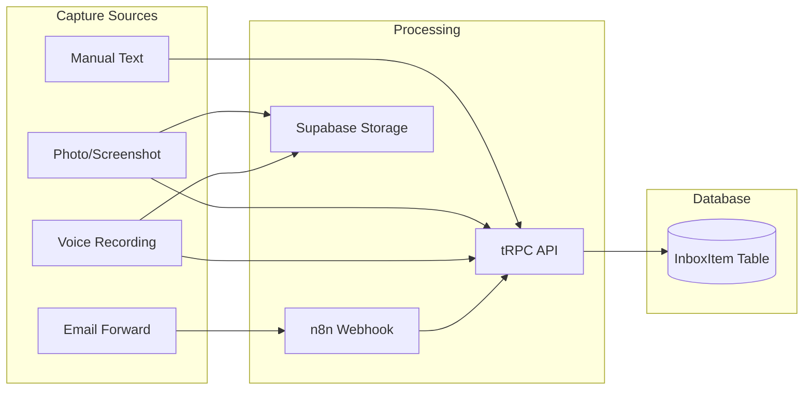

# Epic 2: Unified Inbox & Capture

## Epic Overview

| Field                 | Value                                                      |
| --------------------- | ---------------------------------------------------------- |
| **Epic ID**           | E2                                                         |
| **Epic Name**         | Unified Inbox & Capture                                    |
| **Priority**          | P0 - Critical Path                                         |
| **Estimated Stories** | 5                                                          |
| **Dependencies**      | Epic 1 (Foundation & Infrastructure)                       |

## Goal Statement

Enable capturing items from multiple sources (manual text entry, photos/screenshots, voice recording, email forwarding) into a single unified inbox where all items await AI processing and user review.

## Business Value

- Removes the "where should I save this?" decision at capture time
- Provides a single collection point for all ideas, tasks, and information
- Enables the "one behavior only: capture" philosophy
- Sets the foundation for AI classification in Epic 3

## Success Criteria

1. User can capture text notes in under 2 seconds from any screen
2. User can capture photos/screenshots with preview before submission
3. User can capture voice notes with transcription review
4. User can forward emails that automatically appear in inbox
5. User can view all inbox items with source indicators and timestamps
6. Inbox count badge updates in real-time on navigation

## Stories in This Epic

| Story ID            | Title                          | Priority | Dependencies  |
| ------------------- | ------------------------------ | -------- | ------------- |
| [2.1](story-2.1.md) | Manual Text Capture            | P0       | Epic 1        |
| [2.2](story-2.2.md) | Photo & Screenshot Capture     | P1       | 2.1           |
| [2.3](story-2.3.md) | Voice Capture with Transcription| P1       | 2.1           |
| [2.4](story-2.4.md) | Email Forwarding to Inbox      | P2       | 2.1           |
| [2.5](story-2.5.md) | Inbox List View                | P0       | 2.1           |

## Architecture References

- **Data Model:** `InboxItem` entity with type, content, mediaUrl, source, status fields
- **Storage:** Supabase Storage for images and voice recordings
- **API Style:** tRPC for capture endpoints, REST webhook for email forwarding via n8n
- **File Types:** Images (JPEG, PNG, WebP), Audio (WebM, MP3)

### InboxItem Data Flow

### Key Technical Decisions

- **Supabase Storage** for media files (images, audio) - integrated with existing Supabase setup
- **Web Speech API** for voice transcription - no external service cost
- **n8n webhook** for email processing - leverages existing infrastructure
- **tRPC mutations** for all capture operations - type-safe API

See [architecture.md](../../architecture.md) for full technical details.

## Risks & Mitigations

| Risk                              | Probability | Impact | Mitigation                                        |
| --------------------------------- | ----------- | ------ | ------------------------------------------------- |
| Web Speech API browser support    | Medium      | Medium | Fallback to audio-only capture without transcription |
| Supabase Storage upload failures  | Low         | Medium | Retry logic with exponential backoff              |
| Email parsing complexity          | Medium      | Medium | Start simple (text only), add attachments later   |
| Large file uploads timeout        | Low         | Medium | Client-side compression before upload             |

## Definition of Done (Epic Level)

- [ ] All 5 stories completed and verified
- [ ] User can capture from all 4 sources (text, image, voice, email)
- [ ] All captures appear in unified inbox list
- [ ] Inbox count badge works across all navigation views
- [ ] Performance: text capture < 2s, image capture < 5s
- [ ] Mobile-first capture experience optimized for thumb use
- [ ] Integration tests pass for all capture endpoints
